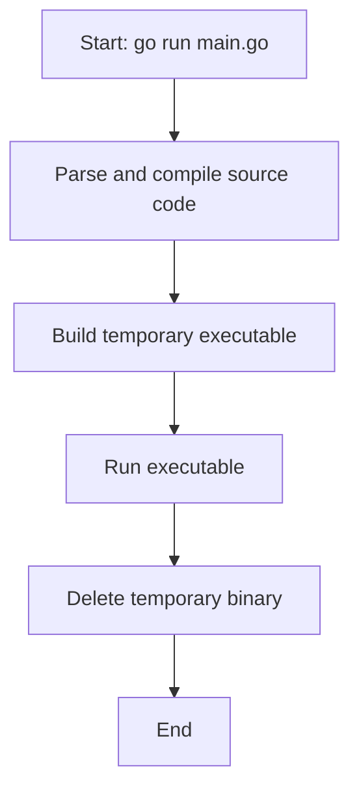

# How `go run` Works

When you run `go run main.go`, Go performs these steps:

1. Parses and compiles your Go source code.
2. Builds a temporary executable binary.
3. Runs the binary.
4. Deletes the temporary binary after execution.

> **Note:** The temporary executable is created in your system's temporary directory. On Windows, this is usually something like `C:\Users\<YourUsername>\AppData\Local\Temp`. The file is deleted automatically after your program finishes running.

## Flowchart

This shows the typical flow of `go run` behind the scenes.
